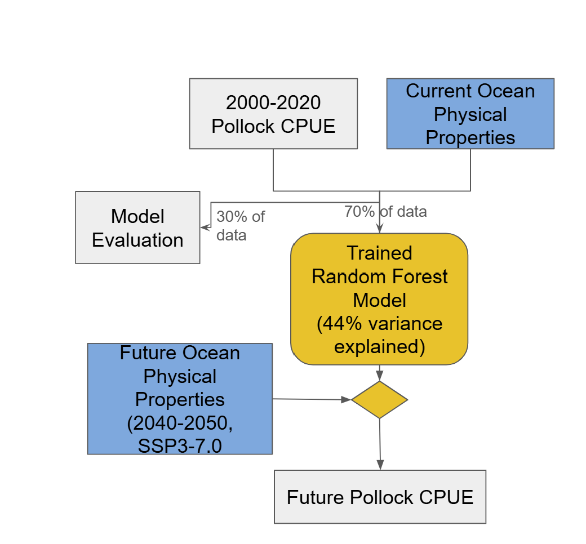

# Modeling the Eastern Bering Sea Pollock Fishery with Predicted Climate Models
Repository for work and code for GEOG463/563 project on pollock modeling and impacts

# Issue
The walleye pollock (*Gadus chalcogrammus*, previously *Theraga Chalcogramma*) fishery is critical to the economy of the Bering Sea. Pollock brought in $525 million dollars in revenue in the Eastern Bering Sea alone 2023 (NOAA Fisheries). Temperature is a limiting factor to them, and sea ice algal blooms provide them food. With changing ocean conditions, the regions of best pollock fishing may move. Because of the Russian and US EEZ's meeting in the region, any movement of pollock affects access to this productive fishery. 

# Methods and objectives
By looking at how ocean conditions affect pollock currently, we hope to predict how the fishery will be distributed under future ocean condtions. 

Our goals are:
- Pair pollock catch (in catch per unit effort) to ocean conditions at that site
- Correlate CPUE to these conditions in a random forest model
- Apply this model to predicted ocean condtions for the region (2030,2040,2050 etc)
- Inform possible US fisheries solutions to changes in pollock catch per year

Previous work has shown this approach is feasible, though the exploratory model could use some refinement. Below is a predicted pollock catch per unit effort (kg of pollock / ha trawled) map for 2040 under CMIP6's SSP3.70 model. The model was trained off of benthic ocean temperature, mean percent sea ice cover, benthic dissolved oxygen and depth. 

# Folders and Structure
- Archive: Contains old models and the Jupyter based model made by Pedro Henrique Batista de Barros (removed with public repo, as this is active research)
- Sources: Papers, Books and RIS files used for modeling and whitepaper
- Supplementary_code: R markdown for figure generation. Used to make maps for whitepaper and other uses as needed
- **Working_Model: The actual model in use. Contains datasets needed as well. All analysis conducted here**

# Dependencies
- Run PackageInstall.R
  - Includes: Terra, tidyterra, caret, gridExtra, viridis, randomForest, and biooracler
  - In the terminal use:
    1. cd "C:\Users\*insert*\Documents\GitHub\GEOG463-563-Pollock\Working_Model"
    2. C:\Users\*insert*\Documents\GitHub\GEOG463-563-Pollock\Working_Model>Rscript "PackageInstall.R"
- Data folder kept within the Working_Model folder

# Data Sources
- NOAA DisMAP: https://apps-st.fisheries.noaa.gov/dismap/DisMAP.html
- Bio-ORACLE: https://www.bio-oracle.org/
- GitHub Repo for biooracler R package: https://github.com/bio-oracle/biooracler
